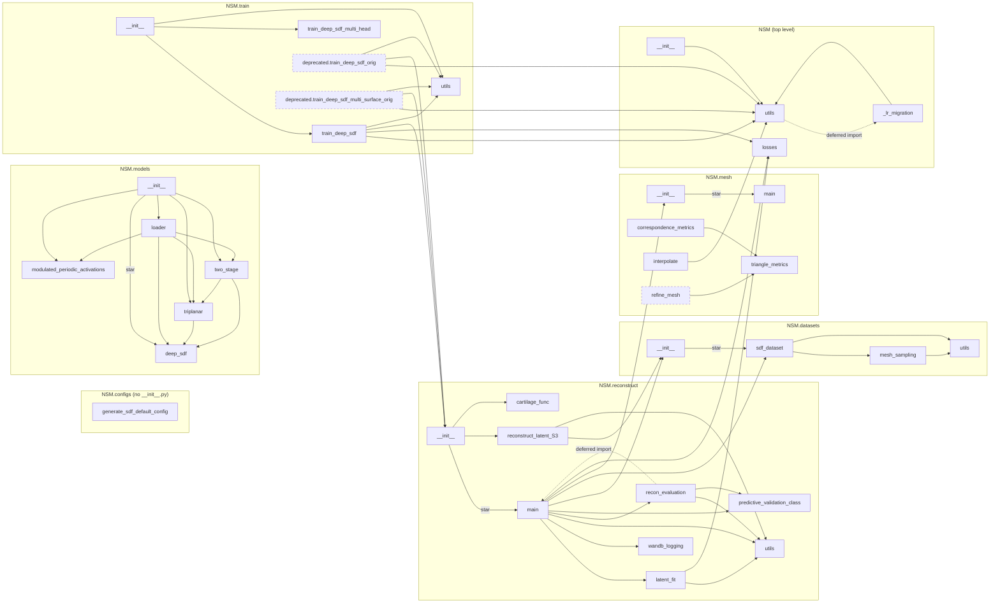

# NSM architecture

**Phase 1 deliverable of `.claude/plans/NSM_CODE_HEALTH_REFACTOR.md`.**
**Verified:** 2026-08-15, against `main` at commit `73a0326`. The `NSM.datasets`
subgraph and its §3 rows re-verified 2026-08-22 after the §8.0 slice-A split of
`sdf_dataset.py` into `datasets/utils.py` + `datasets/mesh_sampling.py`.

> ⚠️ The structural claims below — layering, the single cycle, the star-import surface, the
> six traps — have not been re-checked since the Aug 2026 seeding work, which changed
> `sdf_dataset.py` by 104 lines. Re-run the `ast` pass before relying on any of them.
>
> The same applies to every `file:line` on this page, including §7's defect-class table:
> the counts and the classes hold, but a line number may no longer land on the code it
> names. Re-locate by symbol.

Method: import edges extracted with Python's `ast` over all 55 `.py` files, recording each
import's enclosing scope so deferred imports are distinguished structurally. Coverage from
`pytest testing/ --cov=NSM`. Caller counts exclude `build/lib/`, which is a stale
gitignored copy of the whole package and double-counts every naive `grep -r`.

Findings referenced here were catalogued in a staging register
(`docs/AUDIT_FINDINGS.md`) that was retired on 2026-08-22 once everything in it had a
durable home: issues #40–#61 on the tracker, the `SCOPE.md` §2.8 rulings, and the
Phase-2 prose corrections. The register itself survives in git history; status rulings
are in [`SCOPE.md`](SCOPE.md).

---

## 1. Baseline

Per `CLAUDE.md` § Four rules, the size and coverage numbers that used to be tabulated here
are not committed — they were stale within two days of being written. Regenerate them:

```bash
pytest testing/ --cov=NSM --cov-report=term-missing   # coverage, test count, runtime
tokei NSM/ || cloc NSM/                               # lines
```

Two things about those numbers do **not** regenerate, and are the reason this section
exists at all:

- **Docstring coverage is the wrong metric.** 31 of the documented public symbols have
  docstrings that *contradict* the code. No coverage number detects that; it is what
  Phase 2 is for.
- **Coverage understates the gap.** `train/deprecated/` (880 lines) has no `__init__.py`,
  is never imported, and so does not appear in the denominator at all.

---

## 2. Dependency graph



**Layering is clean and strictly unidirectional:**
`train` → `reconstruct` → {`datasets`, `mesh`, `losses`} → `utils`.
Nothing lower imports anything higher. This is better than the plan assumed, and it means
Phase 4's decompositions are local — no layer inversion has to be untangled first.

**`NSM.models` is fully isolated** — zero edges to or from any other subpackage. That is
why `from NSM.models import TriplanarDecoder` is cheap for the consumer, and it is a
property to preserve deliberately rather than by luck (see `SCOPE.md` §3.3).

**Exactly one cycle,** `utils` ↔ `_lr_migration`, and it is deliberate: deferred at one end
(`utils.resolve_schedule_targets`, inside the `if None in targets:` branch), documented at
both, and
structured so the shim deletes in one line. **Not a refactor target.**

**Hub:** `NSM.utils` has by far the highest in-degree — 8 importers. It is the module that
held the LR bug and it is still the module every change radiates from.

### 2.1 The disconnected mesh cluster

`NSM/mesh/__init__.py` does `from .main import *` and nothing else. So
`{refine_mesh, correspondence_metrics, triangle_metrics, interpolate}` — **1,954 lines,
16% of the library** — are unreachable from any other subpackage. Their only importers are
tests, which reach past the package into `NSM.mesh.<submodule>`.

This is not dead code (see `SCOPE.md` §2.3), but it does mean the repo's two best-tested
modules (`correspondence_metrics` at 94%, `interpolate` at 62%) are structurally invisible
to the library that contains them.

---

## 3. Module ledger

Only the columns that do **not** regenerate. Line counts, coverage and importer counts are
a command away (§1); `bad` is the count of docstrings that *contradict* the implementation,
which is audit judgement and exists nowhere else. Status rulings and their reasoning are in
[`SCOPE.md`](SCOPE.md) §2 — this is the index, that is the argument.

Modules with no inaccurate docstrings and an unremarkable status are omitted.

| Module | bad | Status |
|---|---|---|
| `datasets/sdf_dataset.py` | 7 | prod — classes only since the §8.0 slice-A move (2026-08-22); since §8.0.F (2026-08-24) the cache shell (`get_sample_data_dict`) runs once in `SDFSamples`, with the class-specific halves in the private `_build_subject` / `_upgrade_cached_layout` hooks, and the cache key is the named `hash_params` mapping |
| `mesh/refine_mesh.py` | 6 | research — raises on its own defaults |
| `reconstruct/main.py` | 5 | prod — `reconstruct_mesh` only since §8.0.E (2026-08-24: `get_mean_errors` moved, the dead pair deleted); re-import surface for all three split-off modules |
| `reconstruct/latent_fit.py` | 0 | prod — the latent-optimization stack, received from `main.py` (§8.0.C) |
| `reconstruct/wandb_logging.py` | 0 | prod — wandb result preparation, same move |
| `reconstruct/recon_evaluation.py` | 0 | prod — per-subject losses + `get_mean_errors`, received from `main.py` (§8.0.E, 2026-08-24) |
| `mesh/main.py` | 5 | prod |
| `train/utils.py` | 3 | prod |
| `utils.py` | 2 | prod |
| `models/triplanar.py` | 2 | prod |
| `models/loader.py` | 2 | prod |
| `models/deep_sdf.py` | 2 | prod |
| `mesh/interpolate.py` | 2 | prod |
| `losses.py` | 2 | research — gated behind `NotImplementedError` |
| `reconstruct/reconstruct_latent_S3.py` | 2 | deferred research |
| `train/train_deep_sdf_multi_head.py` | 0 | **supported, broken** |
| `train/deprecated/train_deep_sdf_multi_surface_orig.py` | 0 | **dead → quarantine** |
| `train/deprecated/train_deep_sdf_orig.py` | 0 | **dead after a 12-line port** |
| `datasets/utils.py` | 0 | prod — leaf helpers, received from `sdf_dataset.py` (§8.0, 2026-08-22) |
| `datasets/mesh_sampling.py` | 0 | prod — the two reader pipelines, same move |
| `_lr_migration.py` | 0 | prod (transitional — delete-when in its header) |

**Coverage is inverted relative to risk**, and worse than the plan assumed: the four
modules on the production path (`sdf_dataset`, `reconstruct/main`, `mesh/main`,
`train_deep_sdf`) are the least covered, while the two research modules nothing imports are
the best covered. That ordering is the durable finding; the percentages are not.

---

## 4. Import-time side effects

Ten modules do something at import beyond defining names. Two matter:

**`reconstruct/main.py` — `logging.basicConfig(...)` at module scope.** This
reconfigures the **root logger of the host process**. Because
`reconstruct/__init__.py` star-imports `.main`, it fires on any `import NSM.reconstruct`
— invisible at the call site — and it hits the downstream consumer on every NSM fit.
Nothing inside NSM reads the root logger config, so removing it has no intra-package
dependency. **Highest-value single cleanup in the graph.**

**`NSM/utils.py` — warns at import when `schedulefree` is absent.** Because
`NSM/__init__.py` does `from . import utils`, this fires on *any* `import NSM.*`
whatsoever. It is now a `UserWarning` on **stderr**, not the stdout `print` this entry
described (re-measured 2026-08-26: `python -c 'import NSM'` emits
`UserWarning: schedulefree not found, skipping import`). Why that mattered, and still
does for every *other* import-time print: `kneepipeline/steps/run_nsm.py:340-342` runs
each NSM fit in a subprocess and parses **the last line of its stdout as JSON**, so
NSM's stdout is a contract surface. The general fix is §8.0.G.

The rest: three separate `try/except` optional-dependency probes that print and set module
globals (`recon_evaluation.py`, `sdf_dataset.py`, `correspondence_metrics.py` —
the last silently switches exact point-to-surface distance to a nearest-vertex fallback);
`loss_l1 = torch.nn.L1Loss(...)` instantiated at import in **four** separate training
modules; `today_date` frozen at import time in `sdf_dataset.py`; and top-level `import
wandb` in every trainer.

`configs/generate_sdf_default_config.py` is the fixed reference case — its write is now
`__main__`-guarded, with the prior defect recorded in a comment.

---

## 5. The star-import surface

Four star-imports, all in `__init__` files, and **no `__all__` anywhere in `NSM/`**
(verified: `grep -rn __all__ NSM/` returns nothing). Each therefore re-exports every
non-underscore name in the source module, including its imported third-party modules.

`NSM.reconstruct` is the worst: alongside its real API it publicly exposes `os`, `sys`,
`torch`, `np`, `wandb`, `copy`, `time`, `mskt`, `logging`, `logger`, `fnmatch`,
`create_mesh_adaptive`, `combine_meshes`, `eikonal_loss`, `read_mesh_get_sampled_pts`,
`read_meshes_get_sampled_pts` and `adjust_learning_rate` — 138 de-facto exports across the
package in total.

`NSM.models` inherits a subtler problem: `from .deep_sdf import *` runs *before* the
explicit imports, and `deep_sdf` defines a `Sine` with a hardcoded `w0=30` while
`modulated_periodic_activations` defines a different `Sine` taking `w0` as an argument.
`NSM.models.Sine` resolves to the hardcoded one.

---

## 6. Duplicated logic and name traps

The plan flagged one. There are six.

| Trap | Where | Why it bites |
|---|---|---|
| **Two `adjust_learning_rate`** | `utils.adjust_learning_rate` (target-keyed, per-epoch) and `reconstruct/utils.py` (step decay for latent fitting) | Unrelated signatures, same name, and the second is *leaked into `NSM.reconstruct`'s namespace* by the star-import — so `from NSM.reconstruct import adjust_learning_rate` silently gets the wrong one. |
| **Four `loss_l1 = torch.nn.L1Loss(...)`** | module-level `loss_l1` in `train_deep_sdf.py`, `train_deep_sdf_multi_head.py`, and both `deprecated/` trainers | Four copies of a shared import-time module. |
| **Two `Sine` classes** | `deep_sdf.Sine` (w0 hardcoded, `__init__` misspelled as `__init`, never runs) and `modulated_periodic_activations.Sine` | Incompatible defaults; the star-import decides which one `NSM.models.Sine` means. |
| **Two edge-ratio implementations** | `correspondence_metrics.triangle_health` and `triangle_metrics.py` | Divergent results from the same-named statistic. |
| **`train_deep_sdf` defined twice** | `train/train_deep_sdf.py` and `train/train_deep_sdf_multi_head.py` | Same function name in two modules, second parameter is `model` in one and `models` in the other. Tests alias them to disambiguate. |
| **`unpack_pts` / `unpack_numpy_data`** | `datasets/utils.py` (moved from `sdf_dataset.py`, §8.0) and duplicated verbatim in a testing script | Encodes the `.npz` cache layout in two places. |
| **Latent gradients scale with the query-point count** | `triplanar.UniqueConsecutive` and `triplanar.FastUnique` | Both custom backward passes amplify the latent gradient by N — measured 10.00× at N=10 and 1000.00× at N=1000, **identically on both paths**. It is a long-standing library convention, not a `FastUnique` regression: inside `reconstruct_latent` the reconstruction term reaches the latent through this ×N path while the L2/norm-penalty terms reach the same leaf directly, so an enabled `latent_reg_weight` is effectively divided by the number of query points (`l2reg_recon` is `false` in both shipped configs, so no shipped run is affected). Patching one class alone desynchronises the two decoder interfaces; changing the convention rescales every training run and needs a § History entry. |

---

## 7. Recurring defect classes

216 findings were recorded. Grouping them by *shape* rather than by module is what makes
them actionable, and it is what `CLAUDE.md`'s "fix the class of defect, not the reported
instance" asks for. The LR bug's class is the largest group.

| Class | Count | Representative |
|---|---|---|
| **Undocumented positional/index ordering** — the LR bug's exact shape | ~12 | `reconstruct_mesh`: reconstructed mesh order *is* the surface identity contract, named nowhere, hardcoded by the consumer. `losses.compute_sdf_gradients`: `cat([latent, points])` with nothing validating the width. `mesh.create_mesh_adaptive`: 17 positional args into `create_mesh`. |
| **Parameter accepted and silently ignored** | ~10 | `get_pts_center_and_scale`: `center=` / `scale=` are rebound before they are read, so both operations happen unconditionally. `n_pts_random` swallowed by `**kwargs` — the consumer passes 100,000 for it. |
| **Silent in-place mutation of caller data** | 7 | `get_pts_center_and_scale` mutates the passed array; all three in-repo callers pass `np.copy()` defensively, so the convention exists only as a habit at the call sites. |
| **Cache key omits a parameter that changes cached content** | 4 | *Fixed by [#19](https://github.com/gattia/nsm/issues/19) in PR #85 (§8.0.F).* `mesh_to_scale` and `uniform_pts_buffer` are in the key; `subsample` was decoupled from cached content instead of keyed; the key is a named canonical mapping with a `cache_format` version. Kept as a defect *class* because it is the one that silently served another run's data — see `KNOWN_ISSUES.md` § History 13. |
| **Import-time side effect** | 10 | §4 above. |
| **Constructed and discarded / leaked loop variable** | 3 | `train_deep_sdf_multi_head.train_deep_sdf` (only the last decoder trains), `read_meshes_get_sampled_pts`, `VAEDecoder.__init__` (the activation is built and never appended — the VAE decoder has no pointwise nonlinearity; see §7.1). |
| **Constructible-but-uncallable configuration** | 5 | `Decoder(activation='linear')`, `progressive_add_depth=True`, `refine_mesh.get_target_cells()` with its own defaults — each builds fine and raises on first use. Two entries deviate, verified by execution: `TwoStageDecoder()` with its own defaults raises in `__init__` (tuple + list concat), so it never builds; and `Decoder(norm_layers=...)` builds *and forwards without error* under the shipped contiguous default with weight-norm on (the norm layers are silently ignored) — it raises on first use only for a norm set not starting at layer 0 with weight-norm off. |

**71 of the 216 are landmines** — wrong behaviour that raises nothing and returns a
plausible number. This is the empirical argument for the plan's §7.1 ordering: a test that
asserts "it ran" catches almost none of them.

### 7.1 Worked example: the VAE decoder's missing activation

Included because the first draft of this document got it wrong, and the correction is more
interesting than the original claim.

**The defect is real.** `VAEDecoder.__init__` builds `activation = activation_fn()` and never
appends it, while the two lines above it do `self.layers.append(...)`. The resulting stack
is `ConvTranspose2d → norm` × N, then `Conv2d → Tanh`. `LeakyReLU` appears nowhere; the
only pointwise nonlinearity in the entire feature-plane generator is the final `Tanh`.

**The first draft then claimed this leaves the decoder "an affine map." That is false for
the shipped models,** and the correction matters:

| `conv_norm_type` | Additivity error, eval mode | Affine? |
|---|---|---|
| `"layer"` — **both shipped models (647, 551)** | 3.74e+00 (value scale 8.44e+00) | **No** |
| `"batch"` — **the `VAEDecoder` constructor default** | 2.89e-07 | **Yes** |
| `conv_norm=False` | 2.92e-07 | **Yes** |

LayerNorm divides by a standard deviation computed from its own input, so it is nonlinear
in its own right and silently supplies the nonlinearity the missing activation was meant
to. The production models work, and they work by accident.

**The sharper hazard the correction exposes:** with `norm_type="batch"` the model *trains*
nonlinear — batch statistics couple samples, additivity error 4.08 — and *evaluates* affine
once BatchNorm switches to running statistics. The function being fit is not in the same
expressive class as the function being deployed. `batch` is the constructor default, so any
config omitting `conv_norm_type` gets it.

In every configuration the depth is still largely wasted: five stacked `ConvTranspose2d`
with no activation between them buy much less than five layers of a normal decoder.

**Method note.** The original claim came from reading the code and was reported as verified.
It took ~20 lines of `torch` to falsify. This is exactly `CLAUDE.md`'s "run the claim before
you write it" — and the same rule applies to an audit's own findings, not just to fixes.

---

## 8. Tooling defects found while mapping

Moved to [`KNOWN_ISSUES.md`](KNOWN_ISSUES.md) § Open § Tooling, which is where open defects
live. One that is structural rather than a defect, and so stays here:

**`NSM.configs` and `NSM.train.deprecated` are absent from the built distribution** — no
`__init__.py`, no `package-data`. Editable installs mask it, which is why nobody has hit
it. It is a packaging property of the layout above, not a bug with a line number.

**Phase 2's plan to enforce docstrings through `make lint` cannot work as written**: that
job is `continue-on-error` with a large pre-existing backlog, so a new rule added to it
lands in a job that cannot fail. Docstring enforcement needs its own gating check, scoped
to the API contract.
