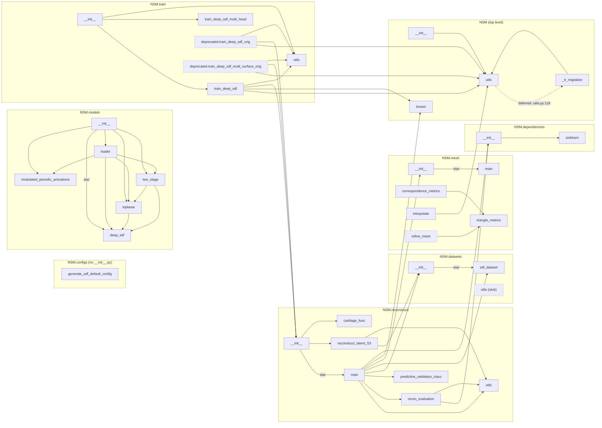

# NSM architecture

**Phase 1 deliverable of `.claude/plans/NSM_CODE_HEALTH_REFACTOR.md`.**
Measured against `main` at commit `73a0326`, 2026-08-15.

Method: import edges extracted with Python's `ast` over all 55 `.py` files, recording each
import's enclosing scope so deferred imports are distinguished structurally. Coverage from
`pytest testing/ --cov=NSM`. Caller counts exclude `build/lib/`, which is a stale
gitignored copy of the whole package and double-counts every naive `grep -r`.

Findings referenced here are catalogued in [`AUDIT_FINDINGS.md`](AUDIT_FINDINGS.md);
status rulings are in [`SCOPE.md`](SCOPE.md).

---

## 1. Baseline

The plan's §1.3 table was measured on 2026-08-14, before PRs #9–#11 merged. Re-measured:

| Metric | Plan §1.3 | On `main` today |
|---|---|---|
| `NSM/` source | 11,565 lines | **11,861** |
| Tests | 100 + 1 skip | **153 + 1 skip** |
| Suite runtime | 13s | 13.1s (18.1s with coverage) |
| Coverage | 32% | **34%** (4,459 statements) |
| Docstrings, module-level public | 48% (mixed denominator) | **64% of functions (84/131), 35% of classes (9/26)** |

The docstring figures are not comparable — the plan's 247 denominator includes methods.
Both are also the wrong metric: **31 of the documented public symbols have docstrings that
contradict the code**, which no coverage number detects. That is what Phase 2 is for.

Coverage understates the gap: `train/deprecated/` (880 lines) has no `__init__.py`, is
never imported, and so does not appear in the 4,459-statement denominator at all.

---

## 2. Dependency graph

**Layering is clean and strictly unidirectional:**
`train` → `reconstruct` → {`datasets`, `mesh`, `losses`, `dependencies`} → `utils`.
Nothing lower imports anything higher. This is better than the plan assumed, and it means
Phase 4's decompositions are local — no layer inversion has to be untangled first.

**`NSM.models` is fully isolated** — zero edges to or from any other subpackage. That is
why `from NSM.models import TriplanarDecoder` is cheap for the consumer, and it is a
property to preserve deliberately rather than by luck (see `SCOPE.md` §3.3).

**Exactly one cycle,** `utils` ↔ `_lr_migration`, and it is deliberate: deferred at one end
(`utils.py:116`, inside the `if None in targets:` branch), documented at both, and
structured so the shim deletes in one line. **Not a refactor target.**

**Hub:** `NSM.utils` has by far the highest in-degree — 8 importers. It is the module that
held the LR bug and it is still the module every change radiates from.

### 2.1 The disconnected mesh cluster

`NSM/mesh/__init__.py` does `from .main import *` and nothing else. So
`{refine_mesh, correspondence_metrics, triangle_metrics, interpolate}` — **1,954 lines,
16% of the library** — are unreachable from any other subpackage. Their only importers are
tests, which reach past the package into `NSM.mesh.<submodule>`.

This is not dead code (see `SCOPE.md` §2.3), but it does mean the repo's two best-tested
modules (`correspondence_metrics` at 94%, `interpolate` at 62%) are structurally invisible
to the library that contains them.

---

## 3. Module ledger

`doc` = documented / total module-level public functions + classes.
`bad` = docstrings that contradict the implementation.
`in` / `ext` = importers in-repo / in `kneepipeline`.

| Module | Lines | Cov | doc | bad | in | ext | Status |
|---|---|---|---|---|---|---|---|
| `datasets/sdf_dataset.py` | 2195 | 7% | 10/14 | 7 | 6 | 4 | prod |
| `reconstruct/main.py` | 1443 | 24% | 7/13 | 5 | 6 | 3 | prod |
| `mesh/main.py` | 867 | 62% | 8/13 | 5 | 3 | 0 | prod |
| `mesh/correspondence_metrics.py` | 699 | 94% | 9/9 | 1 | 1 | 0 | research |
| `mesh/interpolate.py` | 678 | 62% | 9/11 | 2 | 1 | 0 | prod |
| `train/train_deep_sdf.py` | 629 | 10% | 0/2 | 0 | 2 | 0 | prod |
| `train/deprecated/train_deep_sdf_multi_surface_orig.py` | 562 | — | 0/2 | 0 | 0 | 0 | **dead → quarantine** |
| `mesh/refine_mesh.py` | 480 | 0% | 14/14 | 6 | 0 | 0 | research |
| `utils.py` | 445 | 55% | 6/19 | 2 | 9 | 0 | prod |
| `train/train_deep_sdf_multi_head.py` | 428 | 11% | 0/2 | 0 | 2 | 0 | **supported, broken** |
| `models/triplanar.py` | 413 | 77% | 2/4 | 2 | 5 | 6 | prod |
| `models/loader.py` | 387 | 84% | 3/3 | 2 | 4 | 0 | prod |
| `reconstruct/reconstruct_latent_S3.py` | 350 | 4% | 2/3 | 2 | 1 | 0 | deferred research |
| `train/deprecated/train_deep_sdf_orig.py` | 318 | — | 0/2 | 0 | 0 | 0 | **dead after 12-line port** |
| `models/deep_sdf.py` | 310 | 57% | 3/5 | 2 | 5 | 0 | prod |
| `models/modulated_periodic_activations.py` | 252 | 67% | 1/9 | 1 | 3 | 0 | research |
| `losses.py` | 231 | 10% | 5/5 | 2 | 2 | 0 | research |
| `dependencies/sinkhorn.py` | 164 | 6% | 1/1 | 1 | 3 | 0 | research |
| `reconstruct/cartilage_func.py` | 149 | 18% | 0/5 | 0 | 3 | 0 | prod |
| `train/utils.py` | 125 | 52% | 4/6 | 3 | 6 | 0 | prod |
| `reconstruct/recon_evaluation.py` | 121 | 13% | 1/1 | 1 | 1 | 0 | prod |
| `configs/generate_sdf_default_config.py` | 112 | 60% | 1/1 | 0 | 4 | 0 | supported |
| `reconstruct/utils.py` | 107 | 38% | 4/5 | 1 | 3 | 0 | prod |
| `reconstruct/predictive_validation_class.py` | 97 | 28% | 1/1 | 1 | 1 | 0 | research |
| `mesh/triangle_metrics.py` | 97 | 65% | 0/5 | 0 | 2 | 0 | research |
| `models/two_stage.py` | 92 | 100% | 1/1 | 1 | 3 | 0 | research |
| `_lr_migration.py` | 76 | 100% | 1/1 | 0 | 1 | 0 | prod (transitional) |
| `__init__.py` | 11 | 100% | — | 0 | 3 | 6 | prod |
| `reconstruct/__init__.py` | 9 | 100% | — | 0 | 5 | 3 | prod |
| `models/__init__.py` | 5 | 100% | — | 0 | 3 | 3 | prod |
| `train/__init__.py` | 5 | 100% | — | 0 | 3 | 0 | prod |
| `datasets/utils.py` | 2 | 100% | — | 0 | 0 | 0 | **dead (2-line TODO)** |
| `datasets/__init__.py` | 1 | 100% | — | 0 | 3 | 1 | prod |
| `mesh/__init__.py` | 1 | 100% | — | 0 | 1 | 0 | prod |

The plan's observation that coverage is inverted relative to risk holds and is worse than
stated: the four modules on the production path (`sdf_dataset`, `reconstruct/main`,
`mesh/main`, `train_deep_sdf`) are 5,134 lines at a weighted 17%, while the two research
modules nothing imports sit at 94% and 62%.

---

## 4. Import-time side effects

Ten modules do something at import beyond defining names. Two matter:

**`reconstruct/main.py:26` — `logging.basicConfig(...)` at module scope.** This
reconfigures the **root logger of the host process**. Because
`reconstruct/__init__.py:1` star-imports `.main`, it fires on any `import NSM.reconstruct`
— invisible at the call site — and it hits the downstream consumer on every NSM fit.
Nothing inside NSM reads the root logger config, so removing it has no intra-package
dependency. **Highest-value single cleanup in the graph.**

**`utils.py:6-10` — prints to stdout when `schedulefree` is absent.** Because
`NSM/__init__.py:9` does `from . import utils`, this fires on *any* `import NSM.*`
whatsoever. `python -c 'import NSM'` emits `schedulefree not found, skipping import`.
The consumer's orchestrator parses the last stdout line of each step as JSON.

The rest: three separate `try/except` optional-dependency probes that print and set module
globals (`recon_evaluation.py:4`, `sdf_dataset.py:18`, `correspondence_metrics.py:68` —
the last silently switches exact point-to-surface distance to a nearest-vertex fallback);
`loss_l1 = torch.nn.L1Loss(...)` instantiated at import in **four** separate training
modules; `today_date` frozen at import time in `sdf_dataset.py:26`; and top-level `import
wandb` in every trainer.

`configs/generate_sdf_default_config.py` is the fixed reference case — its write is now
`__main__`-guarded, with the prior defect recorded in a comment.

---

## 5. The star-import surface

Four star-imports, all in `__init__` files, and **no `__all__` anywhere in `NSM/`**
(verified: `grep -rn __all__ NSM/` returns nothing). Each therefore re-exports every
non-underscore name in the source module, including its imported third-party modules.

`NSM.reconstruct` is the worst: alongside its real API it publicly exposes `os`, `sys`,
`torch`, `np`, `wandb`, `copy`, `time`, `mskt`, `logging`, `logger`, `fnmatch`, `sinkhorn`,
`create_mesh_adaptive`, `combine_meshes`, `eikonal_loss`, `read_mesh_get_sampled_pts`,
`read_meshes_get_sampled_pts` and `adjust_learning_rate` — 138 de-facto exports across the
package in total.

`NSM.models` inherits a subtler problem: `from .deep_sdf import *` runs *before* the
explicit imports, and `deep_sdf` defines a `Sine` with a hardcoded `w0=30` while
`modulated_periodic_activations` defines a different `Sine` taking `w0` as an argument.
`NSM.models.Sine` resolves to the hardcoded one.

---

## 6. Duplicated logic and name traps

The plan flagged one. There are six.

| Trap | Where | Why it bites |
|---|---|---|
| **Two `adjust_learning_rate`** | `utils.py:227` (target-keyed, per-epoch) and `reconstruct/utils.py` (step decay for latent fitting) | Unrelated signatures, same name, and the second is *leaked into `NSM.reconstruct`'s namespace* by the star-import — so `from NSM.reconstruct import adjust_learning_rate` silently gets the wrong one. |
| **Four `loss_l1 = torch.nn.L1Loss(...)`** | `train_deep_sdf.py:49`, `train_deep_sdf_multi_head.py:22`, both `deprecated/` trainers | Four copies of a shared import-time module. |
| **Two `Sine` classes** | `deep_sdf.py:27` (w0 hardcoded, `__init__` misspelled as `__init`, never runs) and `modulated_periodic_activations.py:43` | Incompatible defaults; the star-import decides which one `NSM.models.Sine` means. |
| **Two edge-ratio implementations** | `correspondence_metrics.py:224` and `triangle_metrics.py` | Divergent results from the same-named statistic. |
| **`train_deep_sdf` defined twice** | `train/train_deep_sdf.py` and `train/train_deep_sdf_multi_head.py` | Same function name in two modules, second parameter is `model` in one and `models` in the other. Tests alias them to disambiguate. |
| **`unpack_pts` / `unpack_numpy_data`** | `sdf_dataset.py` and duplicated verbatim in a testing script | Encodes the `.npz` cache layout in two places. |

---

## 7. Recurring defect classes

216 findings were recorded. Grouping them by *shape* rather than by module is what makes
them actionable, and it is what `CLAUDE.md`'s "fix the class of defect, not the reported
instance" asks for. The LR bug's class is the largest group.

| Class | Count | Representative |
|---|---|---|
| **Undocumented positional/index ordering** — the LR bug's exact shape | ~12 | `reconstruct/main.py:1118`: reconstructed mesh order *is* the surface identity contract, named nowhere, hardcoded by the consumer. `losses.py:110`: `cat([latent, points])` with nothing validating the width. `mesh/main.py:690`: 17 positional args into `create_mesh`. |
| **Parameter accepted and silently ignored** | ~10 | `sdf_dataset.py:87`: `center=` / `scale=` are rebound before they are read, so both operations happen unconditionally. `n_pts_random` swallowed by `**kwargs` — the consumer passes 100,000 for it. |
| **Silent in-place mutation of caller data** | 7 | `sdf_dataset.py:91` mutates the passed array; all three in-repo callers pass `np.copy()` defensively, so the convention exists only as a habit at the call sites. |
| **Cache key omits a parameter that changes cached content** | 4 | `mesh_to_scale`, `uniform_pts_buffer`, `subsample` are all absent from `get_hash_params`. |
| **Import-time side effect** | 10 | §4 above. |
| **Constructed and discarded / leaked loop variable** | 3 | `train_deep_sdf_multi_head.py:85` (only the last decoder trains), `sdf_dataset.py:665`, `triplanar.py:87` (the activation is built and never appended — the VAE decoder has no pointwise nonlinearity; see §7.1). |
| **Constructible-but-uncallable configuration** | 5 | `Decoder(activation='linear')`, `Decoder(norm_layers=...)`, `progressive_add_depth=True`, `TwoStageDecoder()` with its own defaults, `refine_mesh.get_target_cells()` with its own defaults. Each builds fine and raises on first use. |

**71 of the 216 are landmines** — wrong behaviour that raises nothing and returns a
plausible number. This is the empirical argument for the plan's §7.1 ordering: a test that
asserts "it ran" catches almost none of them.

### 7.1 Worked example: the VAE decoder's missing activation

Included because the first draft of this document got it wrong, and the correction is more
interesting than the original claim.

**The defect is real.** `triplanar.py:87` builds `activation = activation_fn()` and never
appends it, while the two lines above it do `self.layers.append(...)`. The resulting stack
is `ConvTranspose2d → norm` × N, then `Conv2d → Tanh`. `LeakyReLU` appears nowhere; the
only pointwise nonlinearity in the entire feature-plane generator is the final `Tanh`.

**The first draft then claimed this leaves the decoder "an affine map." That is false for
the shipped models,** and the correction matters:

| `conv_norm_type` | Additivity error, eval mode | Affine? |
|---|---|---|
| `"layer"` — **both shipped models (647, 551)** | 3.74e+00 (value scale 8.44e+00) | **No** |
| `"batch"` — **the `VAEDecoder` constructor default** | 2.89e-07 | **Yes** |
| `conv_norm=False` | 2.92e-07 | **Yes** |

LayerNorm divides by a standard deviation computed from its own input, so it is nonlinear
in its own right and silently supplies the nonlinearity the missing activation was meant
to. The production models work, and they work by accident.

**The sharper hazard the correction exposes:** with `norm_type="batch"` the model *trains*
nonlinear — batch statistics couple samples, additivity error 4.08 — and *evaluates* affine
once BatchNorm switches to running statistics. The function being fit is not in the same
expressive class as the function being deployed. `batch` is the constructor default, so any
config omitting `conv_norm_type` gets it.

In every configuration the depth is still largely wasted: five stacked `ConvTranspose2d`
with no activation between them buy much less than five layers of a normal decoder.

**Method note.** The original claim came from reading the code and was reported as verified.
It took ~20 lines of `torch` to falsify. This is exactly `CLAUDE.md`'s "run the claim before
you write it" — and the same rule applies to an audit's own findings, not just to fixes.

---

## 8. Tooling defects found while mapping

- **`pyproject.toml:95`** — `testpaths = ["tests"]` names a directory that does not exist.
  Collection works only because pytest 8 warns and falls back to rootdir recursion.
  Version-dependent luck.
- **`pyproject.toml`** — `addopts = "-k 'not train_test.py'"` filters a file that no longer
  exists, and `-k` matches test *names*, not filenames, so it could never have worked.
- **`make quick-test` cannot reach its test phase.** It depends on `format`, and `black`
  exits 123 because `testing/testing_h5_vs_np_loading/save_and_load_h5_vs_np.py:1` is a
  shell command, not Python. The same file breaks any AST-based tooling over the repo.
- **`make lint` always fails** — 445 flake8 violations on `main`, including 4 F821
  undefined names. CI marks the lint job `continue-on-error`, so Phase 2's plan to enforce
  docstrings through `make lint` would land in a job that cannot fail. It needs its own
  gating check, scoped to the API contract.
- **`black --check` fails on 9 files** including `reconstruct/main.py`, `mesh/main.py`,
  `losses.py`, `models/triplanar.py` — against a standard `CLAUDE.md` states as met.
- **`NSM.configs` and `NSM.train.deprecated` are absent from the built distribution** (no
  `__init__.py`, no `package-data`). Editable installs mask it.
- **`.github/workflows/docs.yml` invokes `make requirements dev` and `make docs`**, neither
  of which is a target. The documentation site the README links has never been buildable.
